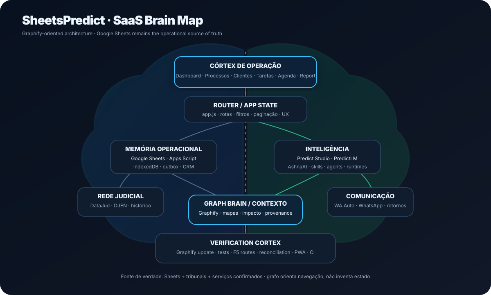

# SheetsPredict

**SheetsPredict** é o cockpit operacional da carteira jurídica conectado ao Google Sheets. A planilha continua sendo a fonte de verdade; o navegador mantém uma réplica local para velocidade e continuidade, enquanto Vercel Functions e Apps Script fazem a ponte segura com serviços externos.

**Versão atual: 4.2.0**

## Mapa cerebral da arquitetura

<p align="center">
  
</p>

O mapa acima representa o SheetsPredict como um cérebro operacional: **córtex de operação**, estado/router, memória em Google Sheets + Apps Script + IndexedDB, inteligência PredictLM/AshnaAI, rede judicial DataJud/DJEN, comunicação WA.Auto e um córtex de verificação.

O **Graphify Brain** complementa esse desenho com um grafo consultável do código. Antes de refactors que atravessam vários módulos, a skill pode usar `query`, `path` e `explain` para localizar dependências, distinguindo relações `EXTRACTED` das `INFERRED`. Código real e testes continuam sendo a fonte final de verificação.

- Skill: [`skills/graphify-brain/SKILL.md`](skills/graphify-brain/SKILL.md)
- Mapa: [`docs/sheetspredict-brain-map.svg`](docs/sheetspredict-brain-map.svg)
- Referência: `Graphify-Labs/graphify`

## Visão geral

O aplicativo reúne em uma única interface:

- Dashboard de carteira, KPIs, retornos, qualidade e produtividade.
- **Processos** da carteira atribuída ao usuário.
- **Processos da empresa** com visão autorizada da carteira completa.
- Clientes 360°, Pipeline CRM, Agenda, Financeiro, Tarefas, Análise e Report.
- DataJud + DJEN, Audit 3D e histórico do tribunal.
- Cache IndexedDB, outbox e funcionamento offline-first.
- Central Integrada com PredictLM, GREY, WA.Auto, SyncCRM, LEADCHECKIN, Leadcheck e regras do LexisPredict.
- **Predict Studio** com Chat, Legal, Build, Work, Tutor, Research, Imagine e Report, mais catálogo completo de skills/agentes/plugins e Runtime Federation local opt-in.
- **WA.Auto nativo** com a interface operacional do WA.Auto adaptada aos temas do SheetsPredict, sessão WhatsApp cloud e automação DataJud/DJEN baseada no último retorno.
- Configurações com temas claros, escuros, jurídicos e de alto contraste.

A regra operacional central continua sendo:

```text
Assistente = dono/carteira
AtendidoPor = quem efetivamente atendeu
Editar != atender
Atender != transferir carteira
```

## Arquitetura

```text
Google Sheets
  ├─ Processos
  ├─ Clientes
  ├─ Interacoes
  ├─ PipelineCRM
  ├─ AgendaCRM
  ├─ TarefasCRM
  ├─ DocumentosCRM
  ├─ Honorarios
  ├─ Movimentações_DataJud
  └─ Publicações_DJEN
          ↕
Apps Script privado
          ↕
Vercel Functions
  ├─ /api/sheets
  ├─ /api/datajud
  ├─ /api/djen
  ├─ /api/judicial-scan
  └─ /api/integration-hub
          ↕
SheetsPredict
          ↕
IndexedDB + outbox + PWA
```

O Google Sheets é persistência operacional. IndexedDB é cache/réplica e não substitui a planilha.

## Navegação e grandes listas

As telas de Processos, Processos da empresa, Clientes e Tarefas começam com **200 registros**. A busca é aplicada antes da paginação e permite localizar cliente, CNJ, advogado, assistente e outros campos relevantes.

Para listas largas:

- existe **uma única rolagem vertical principal**, na área de conteúdo;
- tabelas não mantêm uma segunda rolagem vertical interna;
- existe **uma única barra horizontal fixa** no rodapé quando a tabela ultrapassa a largura disponível;
- a barra horizontal é sincronizada proporcionalmente com o intervalo real de rolagem da tabela;
- a barra horizontal nativa da tabela é ocultada enquanto a barra fixa está assumindo o controle;
- o menu lateral continua rolável em telas baixas, mas sua barra visual fica oculta.

Isso permite trabalhar em zoom de navegador de 100% sem precisar descer até o fim da tabela para encontrar o scroll horizontal.

## Rotas

| Rota | Tela |
|---|---|
| `/` | Dashboard |
| `/central` | Central Integrada |
| `/studio` | Predict Studio |
| `/wa-auto` | WA.Auto integrado |
| `/cases` | Processos da carteira |
| `/processos` | Processos da empresa |
| `/clientes` | Clientes |
| `/pipeline` | Pipeline CRM |
| `/agenda` | Agenda |
| `/financeiro` | Financeiro |
| `/tarefas` | Tarefas |
| `/analise` | Análise |
| `/report` | Report |
| `/scanner` | DataJud + DJEN |
| `/configuracoes` | Configurações e temas |

A navegação interna usa hash routing para resiliência, e o `vercel.json` mantém fallback SPA global para evitar 404 em F5/deep-link.

## CRM no Google Sheets

O CRM permanece distribuído em abas relacionadas por IDs:

| Aba | Função |
|---|---|
| `Clientes` | cadastro 360° |
| `Processos` | carteira jurídica |
| `Interacoes` | registros de contato |
| `PipelineCRM` | funil |
| `AgendaCRM` | compromissos |
| `TarefasCRM` | tarefas manuais |
| `DocumentosCRM` | metadados de documentos |
| `Honorarios` | financeiro/honorários |
| `AuditoriaLogsApp` | trilha de alterações |

Editar ou registrar atendimento não transfere a carteira. O campo `Assistente` permanece como dono; `AtendidoPor` registra quem realizou o atendimento.

## DataJud + DJEN

O módulo judicial inclui:

- consulta DataJud por CNJ;
- normalização e deduplicação de movimentos;
- detecção operacional de encerramento, mérito, cumprimento e novidade;
- DJEN por CNJ e filtros de data;
- persistência do histórico em `Movimentações_DataJud` e `Publicações_DJEN`;
- histórico do tribunal combinando cache persistido + consulta atual;
- atualização do resumo na aba `Processos`.

Endpoint DJEN padrão no backend:

```text
https://comunicaapi.pje.jus.br/api/v1/comunicacao
```

Pode ser alterado por `DJEN_UPSTREAM` para manutenção controlada.

O sistema **não tenta contornar 429/403**. Quando o DJEN está limitado ou bloqueado, o último dado válido é preservado e o DataJud continua funcionando quando disponível.

Configure `DATAJUD_API_KEY` na Vercel. Nenhuma chave deve ser versionada.

## Central Integrada

A rota `/central` unifica oito motores/fontes:

| Motor | Repositório | Papel |
|---|---|---|
| PredictLM | `W2CAPITAL/PredictLm` | IA principal, análise e dossiês |
| WA.Auto | `W2CAPITAL/Wa.Auto` | WhatsApp, fila e monitor |
| LexisPredict | `W2CAPITAL/LexisPredict` | regras jurídicas e KPIs |
| SyncCRM | `W1CAPITAL/SyncCRM` | auditoria e mapeamento de planilha |
| LEADCHECKIN | `W2CAPITAL/LEADCHECKIN` | scanner e descoberta pública |
| OFFLINE-LEXISPREDICT | `W1CAPITAL/OFFLINE-LEXISPREDICT` | continuidade offline |
| Leadcheck | `W1CAPITAL/Leadcheck` | Bacen e triagem revisional |
| GREY | `W1CAPITAL/GREY` | IA privada/self-hosted e fallback |

Abas da Central:

```text
Visão geral | IA | WhatsApp | Leads | Revisional | Planilha | Integrações
```

Funcionalidades embutidas, como auditoria da planilha, Bacen/revisional, scanner público e núcleo offline, continuam funcionando sem os serviços remotos.

Variáveis opcionais:

```dotenv
PREDICTLM_URL=
PREDICTLM_ACCESS_TOKEN=

WA_AUTO_URL=

GREY_URL=
GREY_API_KEY=

LEADCHECKIN_URL=

LEXISPREDICT_URL=
LEXISPREDICT_TOKEN=
```

O envio avulso continua exigindo ação explícita. A automação processual só envia depois que o usuário habilita o interruptor no módulo WA.Auto e continua sujeita às regras de fila/opt-out do WA.Auto.

## WA.Auto integrado

A rota `/wa-auto` incorpora a operação do repositório `W2CAPITAL/Wa.Auto` ao SheetsPredict sem abrir um segundo cliente WhatsApp.

A interface reproduz a hierarquia operacional do WA.Auto:

```text
Campanhas · WhatsApp · Clientes · Histórico · Processos · Configurações
```

Ela usa os tokens de tema do SheetsPredict, portanto Dark, Midnight, Graphite, Vinho Jurídico, Alto Contraste e os demais temas continuam aplicados. A navegação interna é horizontal para evitar uma segunda sidebar.

### Sessão WhatsApp

O SheetsPredict usa `WA_AUTO_URL` como backend. QR Code, pareamento, sessão Baileys, lista de não contatar, fila, ACKs e recuperação permanecem no WA.Auto.

```text
SheetsPredict /#/wa-auto
       ↓
/api/wa-auto
       ↓ HTTPS
WA.Auto Cloud
       ├─ sessão WhatsApp
       ├─ fila segura
       ├─ opt-out
       └─ monitor DataJud + DJEN
```

O navegador nunca recebe o CSRF interno do WA.Auto. O proxy server-side obtém o token de bootstrap e só permite uma lista fixa de ações.

### Automação de atualização processual

A automação é **desligada por padrão**. Ao ativá-la na interface:

1. o SheetsPredict sincroniza primeiro toda a carteira em lotes de **200**;
2. cada processo envia CNJ, cliente, telefone, último/próximo retorno, último DataJud salvo e último DJEN salvo;
3. clientes marcados como opt-out/NÃO CONTATAR são sincronizados como bloqueio;
4. somente depois dessa sincronização o WA.Auto libera `notify_whatsapp`;
5. o WA.Auto continua consultando **seu próprio DataJud + DJEN**;
6. somente eventos posteriores ao limite `max(Último Retorno, Último Aviso)` entram na fila;
7. eventos antigos viram linha de base ou `covered_by_return`;
8. se o WhatsApp estiver desconectado, a novidade fica aguardando em vez de ser perdida;
9. após envio confirmado, o WA.Auto atualiza seu limite de retorno para impedir repetição.

Formato-base do aviso:

```text
📌 ATUALIZAÇÃO PROCESSUAL

Cliente: <cliente>
Processo: <CNJ>
Fonte: DataJud ou DJEN
Nova movimentação: <evento>
Detalhe: <quando houver>
Data/Hora: <data>

Mensagem automática de acompanhamento.
Responda SAIR se não quiser receber novos avisos.
```

Quando várias novidades do mesmo processo estão pendentes, o WA.Auto envia um digest único em vez de uma mensagem por evento.

### Último retorno sincronizado

Registrar atendimento no SheetsPredict também sincroniza imediatamente aquele processo com o WA.Auto. Isso evita que uma movimentação anterior ao contato humano seja enviada depois como se fosse novidade.

A sincronização completa também roda em segundo plano depois da atualização do Google Sheets quando a automação estiver habilitada, com throttle para não reenviar milhares de registros desnecessariamente.

### Segurança operacional

- ativar é uma ação explícita do usuário;
- opt-out/NÃO CONTATAR sempre bloqueia o envio;
- falha ambígua durante o envio vira `uncertain` e não é reenviada automaticamente;
- nenhum evento é inventado quando DataJud/DJEN falha;
- o DJEN usado para a automação é o runtime do WA.Auto;
- uma campanha comum ativa continua tendo precedência sobre alertas jurídicos;
- o primeiro scan não dispara histórico antigo.

## Chatbot AshnaAI

O SheetsPredict 4.2 aceita **AshnaAI** como backend OpenAI-compatible para **Chat, Work e Tutor**. A integração é server-side: a chave não é enviada ao navegador.

```dotenv
ASHNA_API_KEY=
ASHNA_BASE_URL=https://api.ashna.ai/v1/api
ASHNA_MODEL=glm-5.3-flash
ASHNA_AGENT_ID=
```

Com `PREDICTLM_URL` configurada, o SheetsPredict tenta o runtime completo do PredictLM primeiro e pode usar AshnaAI como fallback de Chat/Work/Tutor. Sem PredictLM, AshnaAI pode sustentar essas três superfícies diretamente.

`ASHNA_AGENT_ID` permite apontar para um agente criado no painel Ashna; quando ausente, o adapter usa `ASHNA_MODEL`.

Legal, Build, Research, Imagine e Report continuam exigindo o runtime completo do PredictLM, porque dependem de ferramentas e contratos que um endpoint de chat isolado não fornece.

## Predict Studio

A rota `/studio` traz a camada de execução do PredictLM para dentro do SheetsPredict sem incorporar o Next.js inteiro nem acoplar o CRM ao runtime de IA.

### Superfícies

| Superfície | Execução |
|---|---|
| **Chat** | `PredictLM /api/chat` com contexto opcional da carteira |
| **Legal** | `/api/legal/process` + geração de dossiê HTML |
| **Build** | `/api/agent`: explorer → architect → implementer → reviewers → verifier |
| **Work** | Chat com contrato de continuidade, critérios de conclusão e bloqueios |
| **Tutor** | Chat com ciclo probe → teach/practice → assess → review |
| **Research** | `/api/research` com árvore de pesquisa, fontes e cobertura |
| **Imagine** | `/api/media/generate` com reference/identity grounding |
| **Report** | `/api/report-dossier/generate` com FORGE + AEGIS + PARALLAX + Chair/Council |

O proxy `/api/predict-studio` possui uma allowlist fixa de rotas. O navegador não pode fornecer uma URL/path arbitrária de upstream. `PREDICTLM_ACCESS_TOKEN`, quando usado, permanece no backend da Vercel.

### Skill Federation

O SheetsPredict mantém um snapshot auditável do registro real do PredictLM, associado ao commit de origem. Na integração inicial são:

- **81 skills/capabilities registradas**, incluindo Graphify Brain;
- **16 papéis de Agent Fabric**;
- **4 controladores Four-Core**: Fly, Mouse, Macaque e Human;
- **18 providers/rotas conhecidas do Provider Mesh**, incluindo AshnaAI;
- **76 repositórios registrados no Capability Fusion**, incluindo Graphify;
- catálogo de runtimes WebLLM, Transformers.js compatibility, FreeLLMAPI, Ollama, OpenAI-compatible, llama.cpp/llamafile e LowRAM.

A presença no catálogo **não significa que um adapter externo esteja configurado**. A aba Plugins distingue `built-in`, `bridge` e `external`, e o runtime remoto é validado separadamente.

O snapshot é derivado de:

```text
W2CAPITAL/PredictLm
├─ src/lib/skills.ts
├─ src/lib/agent-runtime/agentic-fabric.ts
├─ src/lib/fusion/capability-fabric.ts
└─ skills/predictlm-master/manifest.json
```

### Runtime Federation local

Motores locais são explicitamente opt-in. O SheetsPredict não faz port scanning.

**WebLLM / WebGPU**

- Lite: Qwen3 1.7B;
- Smart: Qwen3.5 4B;
- Power: Qwen3.5 9B;
- seleção Auto usa apenas hints de hardware e o carregamento real faz self-test;
- nenhum modelo é baixado até o usuário clicar em **Carregar**;
- modelos grandes podem consumir vários GB e podem ser descarregados pela interface.

**Runtime local manual**

- FreeLLMAPI / API OpenAI-compatible;
- Ollama;
- llama.cpp/llamafile e outros servidores compatíveis através do adapter;
- URL manual em loopback ou HTTPS;
- sem descoberta automática de portas;
- credencial local não passa pelo backend do SheetsPredict.

Transformers.js/ONNX permanece no catálogo de compatibilidade do PredictLM; o runtime direto do SheetsPredict prioriza WebLLM ou um endpoint local explicitamente configurado para não duplicar vários modelos grandes na memória do navegador.

### Isolamento de falhas

O Predict Studio é um módulo separado do `app.js` e não participa da inicialização de Processos, Clientes, Tarefas ou DataJud/DJEN.

```text
app.js
  └─ delega /studio

lib/predict-studio.js
  ├─ UI e estado do Studio
  ├─ Chat / Work / Tutor
  ├─ Legal / Build / Research / Imagine / Report
  └─ catálogo Skills / Agentes / Plugins / Motores

lib/predict-runtime.js
  ├─ WebLLM opt-in
  └─ runtime local manual

api/predict-studio.js
  └─ proxy server-side com allowlist para PredictLM
```

Se `PREDICTLM_URL` não estiver configurada, o restante do SheetsPredict continua operando. A interface deixa claro que as superfícies remotas estão indisponíveis; Skills/Agentes/Plugins e os runtimes locais opt-in continuam acessíveis.

## Interface SaaS 4.2

A camada visual foi revisada sem trocar o modelo de dados nem as rotas existentes. O objetivo é reduzir a aparência de planilha e aproximar o produto de um SaaS operacional maduro:

- sidebar organizada por **Visão / Operação / Gestão / Sistema**;
- contexto de workspace visível, sem criar uma segunda sidebar;
- topbar mais enxuta e hierarquia tipográfica consistente;
- cards/KPIs com densidade uniforme e estados menos “decorativos”;
- tabelas, filtros, pipeline, agenda, diálogos e histórico usando os mesmos tokens;
- sombras, raios, espaçamento e foco padronizados;
- temas continuam usando `--surface`, `--ink`, `--line`, `--primary` e demais tokens, em vez de depender de fundos brancos fixos;
- listas largas preservam a paginação de 200 registros e o scroll global já existente.

A revisão é visual/estrutural: não altera as regras `Assistente = dono`, `AtendidoPor = quem atendeu`, nem a fonte de verdade no Google Sheets.

## Temas e acessibilidade

`Configurações → Tema do aplicativo` oferece:

- SheetsPredict
- Clean
- Dark
- Midnight
- Graphite
- Emerald
- Vinho Jurídico
- Executive Violet
- Imperial Gold
- Alto Contraste

A preferência fica salva no navegador. A camada de temas cobre tabelas, cards, Central Integrada, Tarefas, Pipeline, histórico, Audit 3D, formulários e diálogos.

Os testes verificam contraste mínimo de **4,5:1** nos principais pares de texto/fundo, links, botões e estados semânticos.

## Offline e sincronização

O navegador utiliza IndexedDB para:

- cache de processos e entidades CRM;
- sessão visual;
- outbox de alterações;
- continuidade durante indisponibilidade temporária.

O sync reconcilia gravações por processo. Registros confirmados saem do outbox; conflitos reais ficam preservados para nova tentativa sem travar o restante do lote.

## Apps Script

O projeto vinculado à planilha deve manter um único router:

```text
LexisSheet.gs
  ├─ onOpen()
  ├─ doGet()
  └─ doPost()

Code.gs
  └─ scanner DataJud/DJEN → scannerOnOpen_()

LEXIS-SYNC-AppsScript.gs
  ├─ syncOnOpen_()
  ├─ syncDoGet_()
  └─ syncDoPost_()

LexisApp.gs
  └─ UI interna legada
```

Ao atualizar o bridge, publique uma **nova versão da implantação existente** do Apps Script. Não duplique `doGet`, `doPost` ou `onOpen`.

## Segurança

- Tokens do Apps Script ficam em Script Properties/Vercel Environment Variables.
- O token do bridge não é enviado ao navegador.
- `/api/sheets` aceita somente bridge HTTPS permitido.
- Não versione chaves, tokens ou URLs privadas.
- A autenticação e o escopo da carteira são validados pelo backend/bridge.
- A coluna canônica de propriedade da carteira é `Processos!Assistente`; `CreatedBy` é somente auditoria/proveniência.

## Desenvolvimento e testes

Frontend sem framework de build:

```bash
npm test
npx serve .
```

O pipeline valida, entre outros pontos:

- sintaxe das Vercel Functions e bibliotecas;
- regras DataJud/DJEN;
- histórico judicial;
- escopo de carteira;
- prioridade de tarefas;
- CRM;
- deep-links/F5;
- Central Integrada;
- Predict Studio com oito superfícies do PredictLM;
- WA.Auto integrado com sessão cloud, clientes da carteira e automação DataJud/DJEN opt-in;
- Skill Federation com catálogo auditável de skills/agentes/plugins;
- Runtime Federation local opt-in;
- temas e contraste;
- comportamento de navegação/scroll.

## Deploy

A publicação principal é feita pela Vercel a partir da branch `main`.

Arquivos estáticos usam PWA/service worker; `/api/*` são Vercel Functions. O service worker não deve interceptar navegações de documentos.

Após uma alteração grande de frontend, um `Ctrl+Shift+R` pode ser usado uma vez para forçar o navegador a buscar a versão mais recente do shell.

## Estado atual

**SheetsPredict 4.2.0**

Foco da versão:
- shell SaaS empresarial com navegação agrupada e design tokens consistentes;
- chatbot AshnaAI opcional para Chat/Work/Tutor;
- Graphify Brain + mapas cerebrais versionados;

- Central Integrada;
- identidade SheetsPredict;
- paginação de 200 registros;
- busca nas grandes listas;
- histórico DataJud/DJEN persistente;
- sincronização resiliente;
- temas com contraste validado;
- uma única rolagem vertical de conteúdo;
- uma única barra horizontal útil para tabelas largas;
- correções de F5/deep-link/PWA;
- isolamento da camada de IA para preservar o núcleo operacional em falhas de provider.
